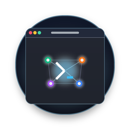
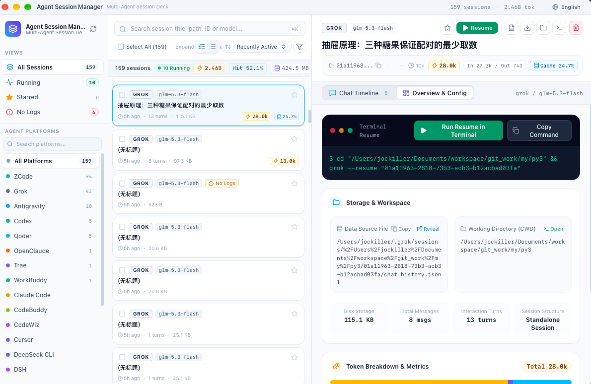

# Agent Session Manager

<p align="center">
  
</p>

<p align="center">
  <strong>AI 코딩 에이전트 & 터미널 어시스턴트 통합 세션 관리 컨트롤 센터</strong>
</p>

<p align="center">
  <a href="#주요-기능">주요 기능</a> •
  <a href="#지원되는-에이전트">지원 에이전트</a> •
  <a href="#다운로드-및-설치">설치</a> •
  <a href="#개발-및-빌드">개발 및 빌드</a> •
  <a href="#macos-gatekeeper-안내">macOS 안내</a>
</p>

<p align="center">
  <a href="README.md">English</a> |
  <a href="README_zh-CN.md">简体中文</a> |
  <a href="README_zh-TW.md">繁體中文</a> |
  <a href="README_ja.md">日本語</a> |
  <a href="README_ko.md">한국어</a>
</p>

---

<p align="center">
  
</p>

## 개요

**Agent Session Manager**는 **Tauri 2**, **Svelte 5**, **Rust**로 제작된 경량 초고속 데스크톱 애플리케이션입니다. Claude Code, OpenAI Codex, OpenCode, OpenClaw, Gemini 등 다양한 AI 코딩 에이전트의 세션 기록을 한곳에서 탐색하고 확인하며, 터미널에서 즉시 재개하고 디스크 용량을 안전하게 정리할 수 있습니다.

---

## 주요 기능

- **멀티 에이전트 통합 워크스페이스**: 18개 이상의 주요 AI 에이전트 및 CLI 도구 세션 자동 스캔 및 통합 관리.
- **정밀한 세션 인스펙터**: 사용자 프롬프트, 모델 응답, 생각 과정(Thinking Traces), 도구 호출(Tool Calls)을 깔끔하게 확인.
- **터미널 원클릭 재개**: '재개' 버튼 클릭 한 번으로 복원 명령어를 복사하고 시스템 터미널(Terminal, iTerm2, Ghostty 등)을 자동 호출하여 즉시 세션 재개.
- **토큰 및 비용 통계**: 프롬프트/완료 토큰 수, 캐시 적중률, 예상 API 비용 및 세션이 차지하는 디스크 용량 실시간 분석.
- **안전한 세션 정리**: 오래되었거나 불필요한 세션을 안전하게 정리하여 디스크 공간 확보.
- **네이티브 데스크톱 경험**: Tauri 2 기반 초경량 메모리 점유율(< 40MB), 유려한 다크 테마 및 시스템 블러 효과 지원.
- **다국어 지원 (i18n)**: 영어, 중국어 간체/번체, 일본어, 한국어 완벽 지원.
- **macOS 보안 서명 및 격리 해제 도구 포함**: Hardened Runtime과 딥 코드 사인, Gatekeeper 격리 해제 스크립트 기본 제공.

---

## 다운로드 및 설치

[Releases 페이지](https://github.com/jockiller/agent-session-manager/releases)에서 운영체제에 맞는 설치 파일을 다운로드하세요:

- **macOS**: `Agent-Session-Manager_x.x.x_aarch64.dmg` / `_x64.dmg`
- **Windows**: `Agent-Session-Manager_x.x.x_x64-setup.exe`
- **Linux**: `Agent-Session-Manager_x.x.x_amd64.AppImage` / `.deb`

### macOS 첫 실행 시 참고사항

macOS Gatekeeper에서 "앱이 손상되었습니다" 등의 안내가 나타나는 경우:
1. 동봉된 `双击解除隔离.command` 스크립트를 더블 클릭하여 실행합니다.
2. 또는 터미널에서 다음 명령어를 실행합니다:
   ```bash
   sudo xattr -dr com.apple.quarantine "/Applications/Agent Session Manager.app"
   ```

---

## 라이선스

[MIT License](LICENSE)로 배포됩니다.
